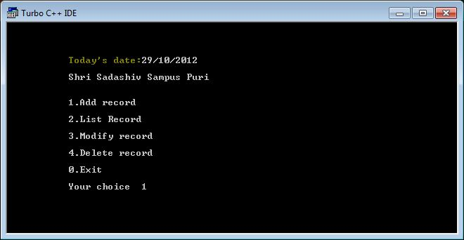
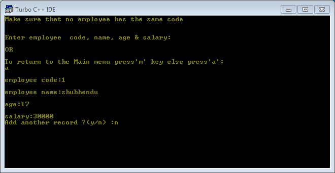
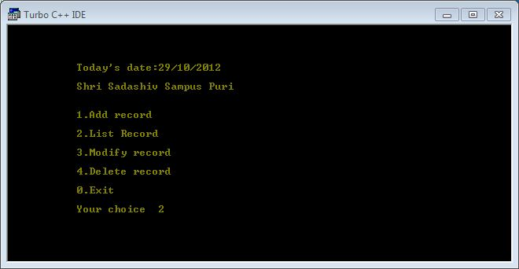
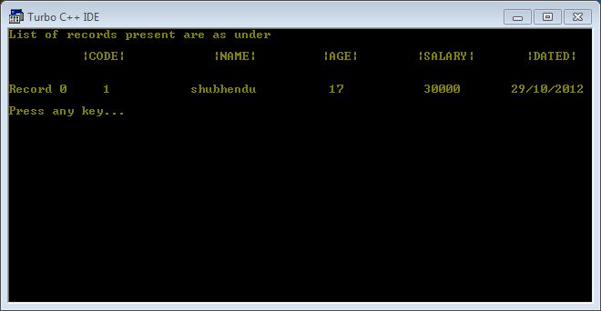
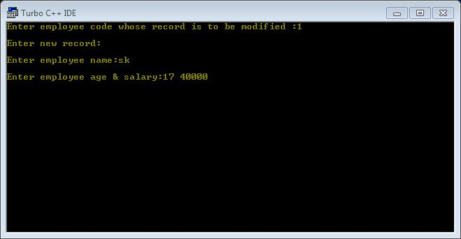
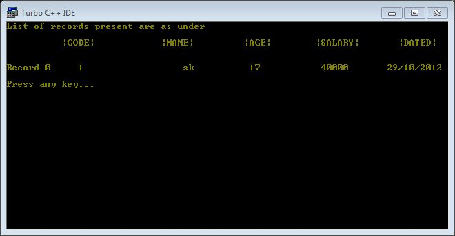
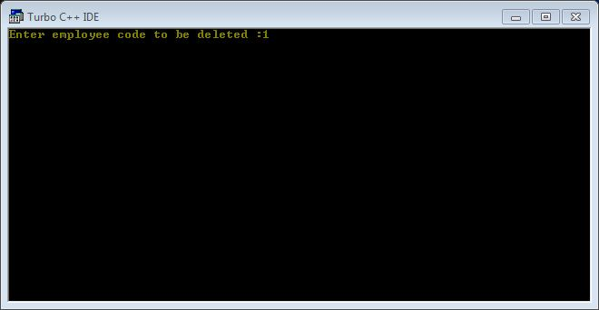
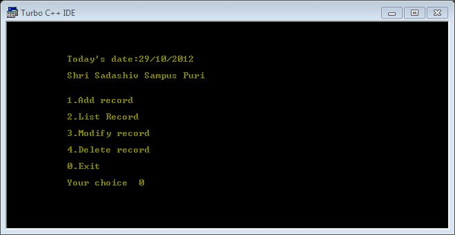

# Employee-Payroll Management System (C++)

## `Screenshots of project`

## Console and Menu Based CRUD operation

## Menu

## `Add Record`

## `Read Records`

## `Update Record`

## `Delete Record`

## `Exit Application`

